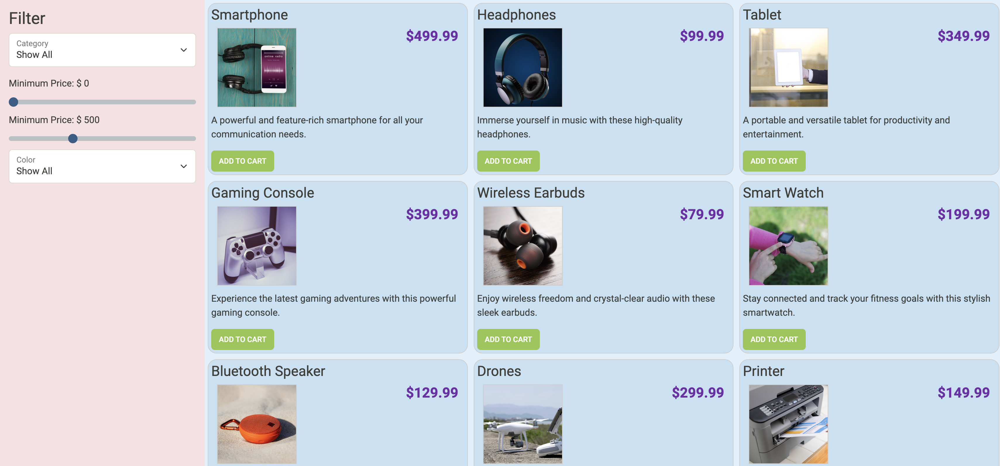
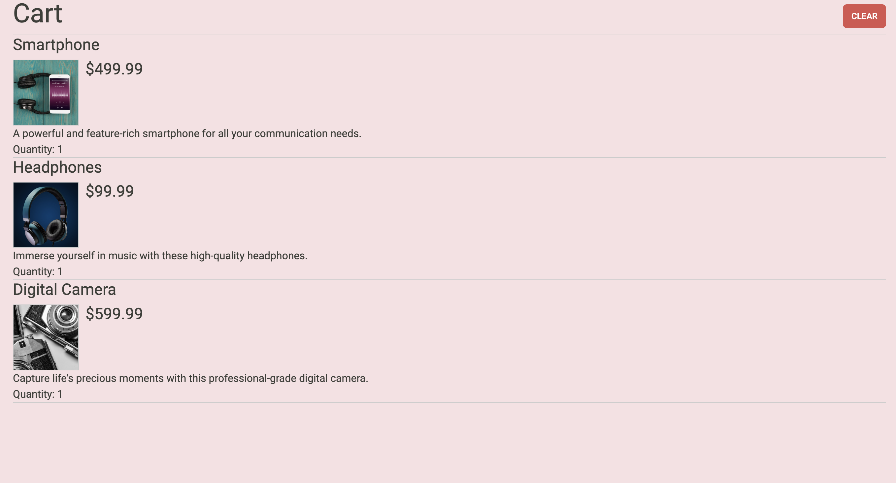
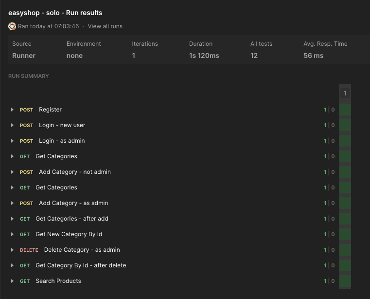

# EasyShop API

## Project Overview

The **EasyShop API** is a RESTful service designed for an online store that allows users to browse products, manage their shopping carts, and complete purchases. It supports various user roles, and provides admin functionality to manage categories and products.

---

## Features Implemented

### Phase 1: Categories Controller

The **CategoriesController** was implemented with CRUD functionality for categories. Only administrators with the `ADMIN` role can perform operations such as adding, updating, or deleting categories.

**Key Endpoints:**
- **GET /categories:** Fetches all categories.
- **POST /categories:** Adds a new category.
- **PUT /categories/{id}:** Updates an existing category.
- **DELETE /categories/{id}:** Deletes a category.

---

### Phase 2: Fix Bugs in Product Search and Duplication

**Bug 1:** Fixed the product search functionality that was returning incorrect results based on search parameters (`categoryId`, `minPrice`, `maxPrice`, `color`).  
**Bug 2:** Resolved the issue of duplicated products appearing in the database, which was caused by editing a product and inadvertently creating duplicates.

**Key Endpoints:**
- **GET /products:** Fetches all products.
- **POST /products:** Adds a new product.
- **PUT /products/{id}:** Updates an existing product.
- **DELETE /products/{id}:** Deletes a product.

---

### Phase 3: Shopping Cart

Implemented shopping cart functionality, where users can add, update, or remove items from their cart.

**Key Endpoints:**
- **GET /cart:** Retrieves the shopping cart for the current user.
- **POST /cart/products/{id}:** Adds a product to the shopping cart.
- **PUT /cart/products/{id}:** Updates the quantity of a product in the cart.
- **DELETE /cart:** Clears the shopping cart for the current user.

---

### Phase 4: User Profile

Users can now view and update their profiles. A profile record is created when a user registers, and they can update it as needed.

**Key Endpoints:**
- **GET /profile:** Retrieves the user's profile.
- **PUT /profile:** Updates the user's profile.

---

### Phase 5: Checkout (Not Implemented)

I did not complete Phase 5, which would have included the checkout process. This feature would allow users to convert their shopping cart into an order and process the transaction.

**Key Endpoint (Not Implemented):**
- **POST /orders:** Creates a new order from the current shopping cart, including creating order line items for each cart item.

---

## Bugs Fixed

### Bug 1: Product Search Logic
The product search functionality was returning incorrect results, especially when using query parameters for filtering products by `categoryId`, `minPrice`, `maxPrice`, and `color`.

**Solution:** Updated the search logic to properly filter products based on the passed query parameters.

### Bug 2: Product Duplication
Some users have reported that the product search functionality was showing duplicated products. For example, a laptop might appear multiple times in the product list even though it is the same product. The issue arose when a product was edited, and each update resulted in a new product entry.

**Solution:**
The issue was caused by the way the product update was handled. Instead of updating the existing product, each update created a new record in the database. This was fixed by ensuring that the `UPDATE` operation is correctly handled to modify the existing product rather than inserting a new one.

---

## Postman Collections

### Collection 1: Authentication and Category Tests

### Collection 2: Product, User Profile, and Cart Operations

---

## Interesting Code: Add to Cart Method

The following code adds a product to the user's shopping cart. It first retrieves the user's details based on their authentication, and then adds the specified product to their cart.

